# 🤖 AI-CASHIER (The Smart kiosks_)

This repository is a pre-built prototype of a **Smart Kiosk** powered by **LLM (Large Language Models)**. It provides an intelligent, interactive system that can engage in human-like conversations and perform kiosk-related functions seamlessly.

---

## 🧠 Overview

The AI-CASHIER system simulates a smart customer assistant integrated into kiosk systems. It uses speech-to-text (STT), natural language processing, and text-to-speech (TTS) to understand users, process their requests, and respond in a natural and human-like way.

---

## 🚀 Features

- 💬 AI-powered smart conversations using `LLM`
- 🎨 Clean and responsive UI integration (planned or partial)
- 🎤 Voice input and 🎧 output using speech components
- 🔄 Modular and extendable pipeline for adding new kiosk tasks

---

## 📁 Repository Structure

### `artifacts/`
Contains all data-related files and records.

- `raw_dataset/` — Raw, unprocessed data collected for development.
- `dataset/` — Cleaned and preprocessed dataset used for training/testing.

---

### `all_trials/`
Houses logs, scripts, or notebooks from various experiments and trials performed during model development and tuning.

---

### `config/`
Configuration and parameter management.

- `config.py` — Core configuration file (e.g., paths, flags).
- `params.py` — Hyperparameters and constants required throughout the codebase.

---

### `main/`
Main application logic and components.

#### `components/`
Each folder here is a module representing different kiosk functionalities:
- `speech_recognition/` — Handles audio input (STT).
- `text_to_speech/` — Converts text responses to speech output.
- `menu_manager/` — Manages and handles menu-related logic.
- `llm_engine/` — Manages LLM interaction and response generation.
- `data_preprocessing/` — Preprocess the conversation data 
- `Intent_recognition/` - Extracting intent from sentences using NLP 

#### `functions/`
Contains shared utility functions used across components (e.g., file handling, logging).

#### `pipelines/`
Defines modular pipeline objects for various components (e.g., STT-to-response flow).

#### `predifine/`
Predefined, hardcoded functions or templates (e.g., greeting, fallback responses).

---

### `models/`
Includes saved base and fine-tuned models required for prediction and inference (e.g., Whisper, TTS models, LLM weights).

---

### `nltk_data/`
Local storage for **Natural Language Toolkit (NLTK)** resources (e.g., tokenizers, stopwords).

---

## ✅ Getting Started

### 🔧 Installation
Make sure you have Python 3.8+ installed. Then set up your virtual environment:

```bash
python -m venv myenv
source myenv/bin/activate  # or myenv\Scripts\activate on Windows
pip install -r requirements.txt
```


## 📈 Code Flow Diagram

```mermaid
---
config:
  theme: redux
---
flowchart TD
 subgraph s1["Components"]
        n8["Internal Storage"]
        n9["Sample Label"]
  end
 subgraph s2["Intent Recognition"]
        n17["NLTK"]
        n18["Hugging-face"]
  end
 subgraph s3["Reinforcement Learning"]
        n22["Collate Action"]
        n23["Feedback"]
        n20["Database"]
        n21["Preprocessing"]
        n24["reinforcement learning"]
        n28["Communication Link"]
  end
 subgraph s4["OUTPUT"]
        n15["Text to Speech"]
        n27["Display"]
  end
 subgraph s5["INPUT"]
        n2["Manual Input"]
        n29["Sample Label"]
        n1["Start"]
        n5["Voice Input"]
  end
    B{"LLM"} --> n11["Multi Process"]
    n1 --> n4["speech to text"]
    n2 --> B
    n4 --> B & n22
    n5 L_n5_n1_0@-- Start --> n1
    n9 <--> n4
    n8 <--> n4
    n11 --> n13["Generated Output"]
    n11 L_n11_n27_0@==> n27
    n13 --> n14["Stop"] & n22
    n13 o--o n17
    n14 L_n14_n15_0@==> n15
    n19["END"] --- n15
    n22 --> n23
    n23 --> n20
    n21 --> n28
    n21 === n24
    n18 o--o n13
    n20 --> n21
    n28 --> B
    n24 --> n28
    n29 --> B
    n8@{ shape: internal-storage}
    n9@{ icon: "gcp:api", pos: "b"}
    n22@{ shape: collate}
    n23@{ icon: "azure:backlog", pos: "t"}
    n20@{ shape: db}
    n21@{ shape: div-proc}
    n24@{ shape: braces}
    n28@{ shape: com-link}
    n15@{ icon: "aws:arch-amazon-simple-notification-service", pos: "t", h: 60}
    n27@{ shape: display}
    n2@{ shape: manual-input}
    n29@{ icon: "fa:file-pdf", pos: "b"}
    n11@{ shape: procs}
    n1@{ shape: start}
    n4@{ shape: rect}
    n5@{ icon: "gcp:speech-to-text", pos: "t", h: 60}
    n14@{ shape: stop}
    n19@{ shape: text}
     n22:::Ash
     n23:::Ash
     n20:::Ash
     n21:::Ash
     n24:::Ash
     n2:::Pine
     B:::Aqua
    classDef Pine stroke-width:1px, stroke-dasharray:none, stroke:#254336, fill:#27654A, color:#FFFFFF
    classDef Aqua stroke-width:1px, stroke-dasharray:none, stroke:#46EDC8, fill:#DEFFF8, color:#378E7A
    classDef Ash stroke-width:1px, stroke-dasharray:none, stroke:#999999, fill:#EEEEEE, color:#000000
    style n28 fill:#FF6D00
    style B color:#000000
    style n5 fill:#000000
    style s4 color:#00C853
    style s5 color:#00C853
    linkStyle 1 stroke:#00C853,fill:none
    linkStyle 5 stroke:#00C853,fill:none
    linkStyle 9 stroke:#2962FF,fill:none
    linkStyle 13 stroke:#2962FF,fill:none
    L_n5_n1_0@{ animation: fast } 
    L_n11_n27_0@{ animation: slow } 
    L_n14_n15_0@{ animation: slow }

```


